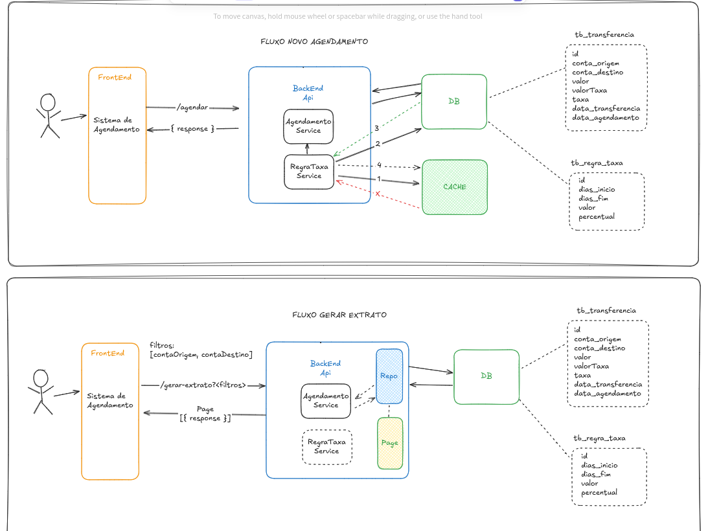

# Sistema de Agendamentos de Transferências Financeiras 
Teste para o desenvolvimento de um sistema de agendamento de transferências financeiras.

## Premissas Backend

- [x] Utilizar linguagem Java (preferência Java 11);
- [x] Utilizar framework Spring Boot 
- [x] Utilizar um banco de dados em memória
    - [url H2](http://localhost:8080/h2-console)

  ### Adicionais
  - [x] [Filtro e Paginação](backend-sat/src/main/java/com/backend_sat/domain/repository/AgendamentoPaginadoRepository.java) para extrato
  - [x] Documentar com Swagger
    - [url Swagger](http://localhost:8080/swagger-ui/index.html)

## Premissas Frontend
- [x] Utilizar VueJS ou Angular


## Decisões
Algumas decisões foram documentadas para melhor entendimento. 

### - Arquitetura: 


Acesse o [excalidraw](https://excalidraw.com/) e importe o [arquivo](registro-de-decisoes/arquitetura.excalidraw) se preferir.

### - Domínio
[Arquivo md](registro-de-decisoes/db.md)

### - Código
[Arquivo md](registro-de-decisoes/code.md)

## Execução do Projeto

Para rodar o projeto localmente deve-se ter instalado e configurado:

- Java 11
- NodeJS 18.3 ou superior
- Npm
- IDE (Para o desenvolvimento do backend foi utilizada IntelliJ e no front VSCode)

#### - Importe o projeto em sua IDE de preferência e execute os seguintes comandos:

- #### Backend
  - entre na pasta do projeto: `cd backend-sat` e execute: 
    - `./mvnw install`
    - `java -jar target/backend-sat-0.0.1-SNAPSHOT.jar` ou crie uma Run Configuration tipo Application e execute o projeto. (Não é necessário utilizar profiles)

- #### Frontend
  - entre na pasta do projeto: `cd frontend-sat` e execute:
    - `npm install`
    - `npm run serve`

### Execução automatizada para ambiente unix like (caso sua IDE permita executar comandos Shell) 

Abra o terminal no diretório do projeto principal e execute o comando abaixo:

```shell
  ROOT_DIR=$(pwd)
  cd "$ROOT_DIR/backend-sat" || exit
  ./mvnw clean install && java -jar target/backend-sat-0.0.1-SNAPSHOT.jar &
  cd "$ROOT_DIR/frontend-sat" || exit 
  npm install && npm run serve &
```
